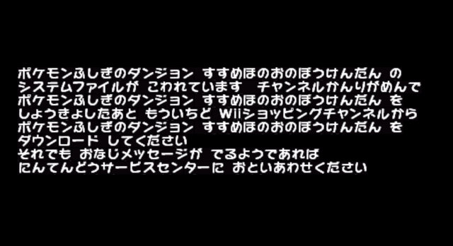

# AT7View
## About
AT7View is an archive extractor/compressor/modifier for the AT7 container format used in the three Pokémon Mystery Dungeon games released for WiiWare in Japan only.
## How to...
### Extract datax_xxxx from the wad
*Note: The x's in datax_xxx represent the number for the data file and 4-letter code of your game.*
1. Using [ShowMiiWads](https://code.google.com/archive/p/showmiiwads/downloads), go to "Tools/Create Common-Key" if you haven't already, and go to "File/Open Folder" and open the folder containing your PMD WiiWare wad(s).
2. Right click the wad and go to "Extract/To Folder". Select where you want to output a folder containing the extracted contents.
3. Go to "Tools/Unpack U8 Archive", and navigate to 00000002.app in where you extracted your wad. The two AT7 data containers are in "00000002_app_OUT/content/".
### Decompress datax_xxxx
1. In AT7View, go to "File/Open" and open the datax_xxxx file you just extracted.
2. Give the program 10-15 seconds to decompress the archive. After that, the program will let you know to use the uncompressed datax_xxxx.bin.raw from now on. The files will then load into the view on the left.  
*Note: Trying to open anything other than an AT7 archive will cause a bunch of red X icons to display in the view. So...don't import anything other than AT7 containers.*
### Extract a file from datax_xxxx
1. In the view on the left, select which file you want to extract.
2. Click the "Extract" button and choose a folder to output the file. The file will be created on disk to this location.
### Replace a certain file in datax_xxxx
1. In the view on the left, select which file you want to replace.
2. Click the "Replace" button and choose a file on disk to replace the file in the AT7 archive. The filename inside the archive will not be changed. After clicking out the message that the replacement is done, the modified archive will reload.
### Recompress datax_xxxx
1. In AT7View, go to "File/Recompress" and choose a folder to output the new archive to.
2. Allow the program to recompress the file. Due to the way the compression works and how my programming skill can handle it, it will take somewhere near an hour to recompress.
### Build a wad with the modified datax_xxxx
1. Make a backup of your existing folder of extracted wad contents incase you ever need to refer to a backup. Always a good idea.
2. Go to "00000002_app_OUT/content/" in the folder of extracted contents, and replace the existing datax_xxxx with the modified one.
3. Using ShowMiiWads, go to "Tools/Pack U8 Archive/Without Header". Choose the "00000002_app_OUT" folder, and rename the output to "00000002.app".
3. Choose "No" to having the file LZ77 compressed--the game does not recognize this type of compression. After this, the modified 00000002.app is built.
4. Take any files/folders not originally in the wad out of the game's folder. Then go to "File/Pack Wad", and navigate to the folder to be built into your modified wad.
5. Choose where to output your new wad file. Once the new wad is built launch it into Dolphin or a homebrewed Wii and enjoy your changes.
## Shortcomings
The only real issue so far is with recompression. While the repacked files launch in-game just fine from my testing, the compression is very slow, even after a little speed optimization. Being my first serious attempt at a fully-thought out application(let alone a compression system), I have a lot to learn. Maybe someday I'll find out how it can all work out better, but hit me up if you know anything.\
That being said, if you do experience issues with launching modded files, let me know. FYI if the game doesn't like the new data2_xxxx it'll throw this error after the strap screen:

## Credits
-Mark James for the [Silk Icon Set](http://www.famfamfam.com/lab/icons/silk/).  
-Huge thanks to Platinum Lucario and MegaMinerd from Project Pokémon for [their AT7 container research](https://projectpokemon.org/home/forums/topic/43882-pmd-wiiware-at7-file-container-format/). Couldn't have done this without it.\
-Also thanks to psy_commando for providing documentation on some of the formats that happened to be in these games as well as PMD2. Mainly the SIR0 archive format.\
-Nintendo/Chunsoft for these overlooked games. C'mon guys, they're not *that* bad. :P
